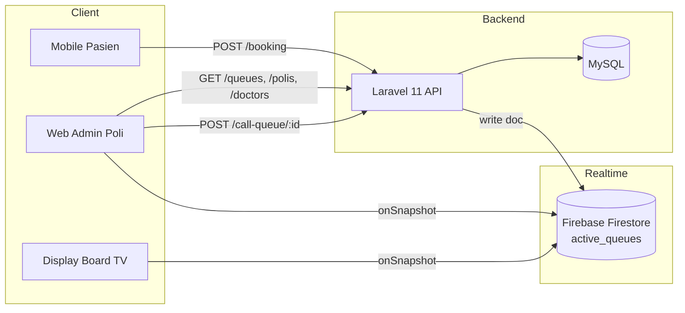
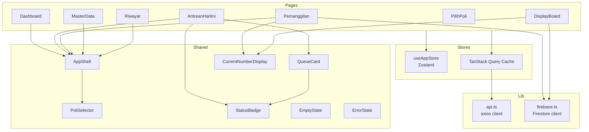
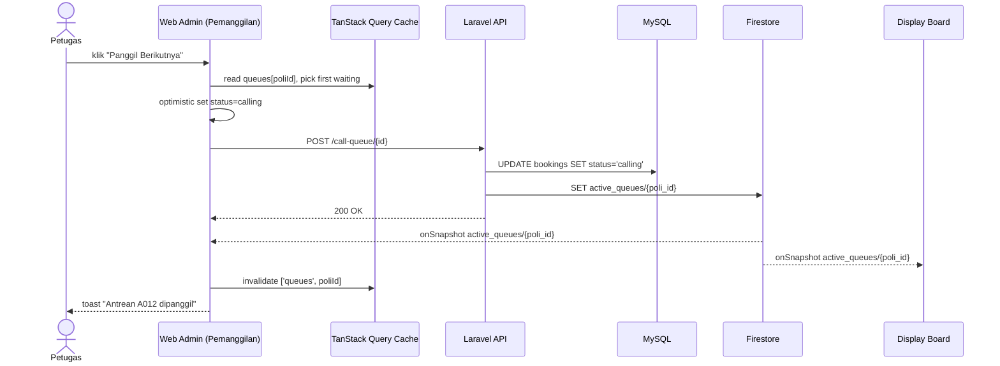
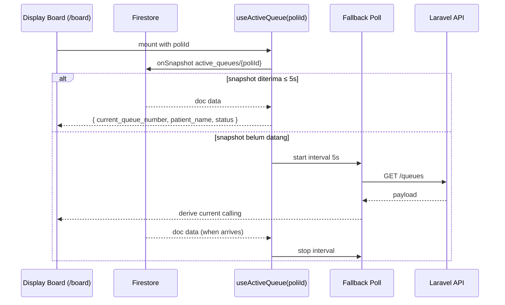
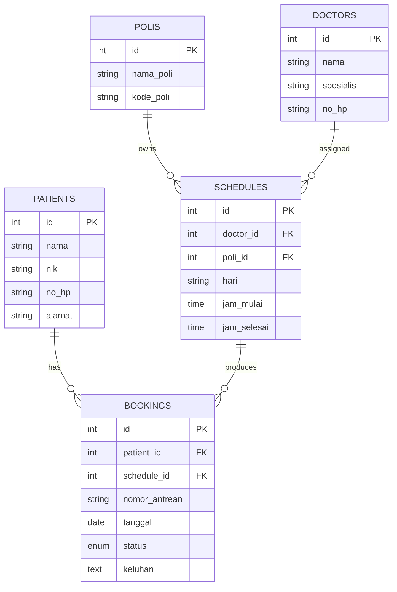

# Design: Web Admin Antrean Puskesmas Cerdas

## Overview

**Antrean Puskesmas Cerdas** adalah proyek kelas yang membangun sistem antrean digital untuk Puskesmas di Indonesia. Sistem ini memodernisasi alur antrean tradisional (kertas dan teriakan nama) menjadi alur digital terintegrasi: pasien memesan slot dari aplikasi mobile, petugas administrasi memanggil antrean dari web admin, dan papan tampilan di ruang tunggu memperbarui nomor yang sedang dipanggil secara realtime. Backend menggunakan Laravel 11 (REST API + MySQL) dengan Firebase Firestore sebagai jembatan realtime antar perangkat.

**Web Admin Poli** adalah aplikasi yang menjadi fokus dokumen ini. Aplikasi ini dipakai oleh petugas administrasi di setiap poli (Umum, Gigi, KIA, Lansia, dst.). Tugas utamanya: melihat antrean hari ini, memanggil pasien berikutnya, menandai status pasien (selesai atau lewati), serta menyajikan **Display Board** fullscreen untuk layar TV di ruang tunggu. Web Admin tidak menangani pendaftaran pasien atau pembuatan booking — itu domain aplikasi mobile pasien.

Hubungan antara Web Admin dengan Mobile Pasien bersifat asimetris dan sinkron melalui dua kanal: kanal request/response (REST Laravel) untuk operasi CRUD, dan kanal realtime (Firestore `active_queues`) untuk siaran nomor antrean yang sedang dipanggil. Mobile Pasien menulis booking baru lewat REST. Web Admin membaca antrean dari REST, lalu memanggil antrean lewat REST, yang oleh backend di-broadcast ke Firestore. Display Board (mode terpisah dalam Web Admin) hanya menjadi konsumen Firestore, sehingga delay pemanggilan ke layar tunggu cukup rendah (sub-detik).

## Tujuan & Non-Tujuan

**Tujuan**

- Memberi petugas poli alat ringkas untuk memanggil antrean berikutnya dalam ≤ 2 klik.
- Menyediakan dashboard situasional (jumlah waiting, calling, done) yang refresh otomatis.
- Menyajikan Display Board fullscreen yang menampilkan nomor antrean yang sedang dipanggil secara realtime.
- Memisahkan konteks per poli sehingga petugas hanya melihat antrean polinya sendiri.
- Mengurangi friksi visual: tipografi besar, kontras tinggi, warna status konsisten.
- Mempersiapkan jalur upgrade ke autentikasi penuh tanpa merombak struktur halaman.

**Non-Tujuan**

- Bukan portal pasien. Tidak ada flow registrasi atau booking dari sisi admin.
- Bukan modul rekam medis. Tidak menyimpan catatan klinis.
- Bukan sistem laporan analitik mendalam. Hanya KPI dasar harian.
- Tidak menggantikan SIMPUS. Sistem ini fokus pada antrean.
- Tidak menyediakan offline-first. Web Admin diasumsikan online di lingkungan Puskesmas.

## Asumsi & Backend Gaps

Web Admin dibangun di atas API yang sudah ada, namun ada beberapa celah backend yang harus dikomunikasikan agar tim sinkron.

- **⚠️ Backend Gap #1 — Tidak ada endpoint autentikasi.** Backend belum punya `/login`, `/register`, atau middleware auth. Web Admin menyiasati dengan **gerbang pemilihan poli** (Poli Selector) yang persisten di `localStorage` (key `puskesmas.admin.poli`). Petugas memilih poli sekali pada perangkat, dan pilihan tersebut dipakai sebagai konteks. Tidak ada jaminan keamanan; harus ditandai sebagai **future work**.
- **⚠️ Backend Gap #2 — Tidak ada endpoint untuk mengubah status booking ke `done` atau `skipped`.** Endpoint `POST /api/call-queue/{id}` hanya menggeser status ke `calling`. Tidak ada cara mengubah status lebih lanjut. Web Admin akan tetap merancang tombol **Selesai** dan **Lewati** pada UI, dan memanggil endpoint `PATCH /api/booking/{id}` (body `{ status }`) yang **belum ada**. Workaround sementara: tombol nonaktif dengan tooltip atau memanggil admin untuk retry manual setelah endpoint tersedia.
- **⚠️ Backend Gap #3 — `GET /api/queues` mengembalikan seluruh poli.** Filter per-poli harus dilakukan client-side. Saat volume membesar, hal ini memboroskan bandwidth. Web Admin melakukan filter berdasarkan `selectedPoliId` di sisi klien dan menandai kebutuhan parameter `?poli_id=` di backend.

## Architecture

> Bagian ini sebelumnya berjudul "High-Level Design"; isinya tetap utuh, hanya heading top-level yang diselaraskan dengan format Kiro spec. Sub-section 4.1–4.8 di bawah ini mendeskripsikan arsitektur sistem secara lengkap (komponen, data flow, ER, tech stack, routing, design system).

### 4.1 Arsitektur Sistem



### 4.2 Komponen Frontend



### 4.3 Data Flow — Memanggil Antrean Berikutnya



### 4.4 Data Flow — Realtime Display Board



### 4.5 ER Overview



### 4.6 Tech Stack

| Layer | Pilihan | Alasan |
|---|---|---|
| Framework UI | React 18 | Standar industri, ekosistem komponen kaya |
| Build tool | Vite | Dev server cepat, HMR instan, config minimal |
| Bahasa | TypeScript | Domain types eksplisit, refactor aman |
| Styling | TailwindCSS | Utility-first, konsisten dengan token design system |
| Komponen | shadcn/ui | Komponen aksesibel berbasis Radix, dapat di-copy |
| Server state | TanStack Query | Cache, retry, dan invalidation siap pakai |
| UI state | Zustand + persist | API minimalis, integrasi `localStorage` mudah |
| Realtime | Firebase JS SDK v10 | Firestore listener `onSnapshot` ringan |
| Routing | React Router v6 | De facto, dukungan nested routes baik |
| Toast | sonner | Ringan, animasi halus, API deklaratif |
| Ikon | lucide-react | Set ikon konsisten, tree-shakeable |

### 4.7 Routing / Sitemap

```mermaid
graph LR
  Root[/] --> Dash[Dashboard]
  Root --> PoliGate[/pilih-poli]
  Dash --> Antr[/antrean]
  Dash --> Pang[/pemanggilan]
  Dash --> Mas[/master]
  Dash --> Riw[/riwayat]
  Root --> Board[/board fullscreen]
```

| Rute | Komponen | Akses | Keterangan |
|---|---|---|---|
| `/pilih-poli` | `PilihPoli` | Publik | Gerbang pemilihan poli, redirect bila sudah dipilih |
| `/` | `Dashboard` | Butuh poli terpilih | Ringkasan KPI dan pemanggilan cepat |
| `/antrean` | `AntreanHariIni` | Butuh poli terpilih | Tabel antrean hari ini |
| `/pemanggilan` | `Pemanggilan` | Butuh poli terpilih | Layar pemanggilan utama petugas |
| `/board` | `DisplayBoard` | Butuh poli terpilih | Fullscreen, tanpa AppShell |
| `/master` | `MasterData` | Butuh poli terpilih | Read-only data referensi |
| `/riwayat` | `Riwayat` | Butuh poli terpilih | Placeholder, menunggu backend |

### 4.8 Design System

**Color palette (hex)**

- Primary teal `#0E7C7B`
- Secondary blue `#3DA5D9`
- Accent mint `#73BFB8`
- Success `#10B981`
- Warning `#F59E0B`
- Danger `#EF4444`
- Neutral 900 `#0F172A`
- Neutral 600 `#475569`
- Neutral 400 `#94A3B8`
- Neutral 200 `#E2E8F0`
- Neutral 50 `#F8FAFC`
- Background app `#F1F5F9`

**Status color map**

| Status | Warna isi | Warna teks | Catatan |
|---|---|---|---|
| `waiting` | `#F59E0B` | `#0F172A` | Ikon `Clock` di kiri label |
| `calling` | `#0E7C7B` | `#FFFFFF` | Animasi `pulse` ringan, ikon `Megaphone` |
| `done` | `#10B981` | `#FFFFFF` | Ikon `Check` |
| `skipped` | `#94A3B8` | `#0F172A` | Ikon `SkipForward` |

**Typography**

- Family utama: `Inter`, fallback `Plus Jakarta Sans`, `system-ui`, `sans-serif`.
- Display 56px / weight 700 / line-height 1.05 — dipakai pada Dashboard hero.
- H1 32px / 700 / 1.2.
- H2 24px / 600 / 1.25.
- H3 20px / 600 / 1.3.
- Body 16px / 400 / 1.5.
- Caption 14px / 500 / 1.4.
- Display Board: nomor antrean 240px / 800 / 1.0, nama pasien 64px / 600 / 1.1.

**Spacing tokens (px)**

- 4, 8, 12, 16, 24, 32, 48, 64. Map ke Tailwind `space-1`, `space-2`, `space-3`, `space-4`, `space-6`, `space-8`, `space-12`, `space-16`.

**Radius tokens**

- `sm` 6px, `md` 12px, `lg` 20px, `full` 9999px.

**Shadow tokens**

- `card`: `0 4px 16px rgba(15, 23, 42, 0.06)`.
- `elevated`: `0 12px 40px rgba(15, 23, 42, 0.12)`.
- `focus-ring`: `0 0 0 2px #0E7C7B`.

## Data Models

Tipe domain TypeScript berikut adalah satu-satunya sumber kebenaran (single source of truth) untuk seluruh entitas yang dikonsumsi Web Admin: `Patient`, `Poli`, `Doctor`, `Schedule`, `Booking`, `ActiveQueue`, dan literal type `BookingStatus`. Tipe-tipe ini tinggal di `src/types/` dan di-re-export ke setiap modul yang membutuhkan (API client, Firestore client, hooks, komponen). Skema relasional yang mendasari tipe-tipe ini sudah dipaparkan dalam diagram ER pada section [Architecture / 4.5 ER Overview](#45-er-overview).

### 5.1 TypeScript Domain Types

```ts
export type BookingStatus = 'waiting' | 'calling' | 'done' | 'skipped';

export interface Patient {
  id: number;
  nama: string;
  nik: string;
  no_hp: string;
  alamat: string;
  created_at: string;
  updated_at: string;
}

export interface Poli {
  id: number;
  nama_poli: string;
  kode_poli: string;
  created_at: string;
  updated_at: string;
}

export interface Doctor {
  id: number;
  nama: string;
  spesialis: string;
  no_hp: string;
  created_at: string;
  updated_at: string;
}

export interface Schedule {
  id: number;
  doctor_id: number;
  poli_id: number;
  hari: string;
  jam_mulai: string;
  jam_selesai: string;
  doctor?: Doctor;
  poli?: Poli;
}

export interface Booking {
  id: number;
  patient_id: number;
  schedule_id: number;
  nomor_antrean: string;
  tanggal: string;
  status: BookingStatus;
  keluhan: string | null;
  patient?: Patient;
  schedule?: Schedule;
  created_at: string;
  updated_at: string;
}

export interface ActiveQueue {
  poli_id: number;
  poli_name: string;
  current_queue_number: string;
  booking_id: number;
  patient_name: string;
  status: BookingStatus;
  called_at: string;
  updated_at: string;
}
```

## Components and Interfaces

Bagian ini mendefinisikan kontrak modul-level (HTTP client, Firestore client, store, algoritma bisnis) berikut komponen UI reusable beserta props mereka, dan spesifikasi tiap layar yang dipakai sebagai input untuk Stitch. Sub-section 5.2 hingga 5.9 (sebelumnya tergabung di bawah "Low-Level Design") dipertahankan urutannya agar referensi silang internal tidak rusak.

### 5.2 API Client (`src/lib/api.ts`)

```ts
import axios from 'axios';
import type { Poli, Doctor, Schedule, Booking, BookingStatus } from '@/types';

export const api = axios.create({
  baseURL: import.meta.env.VITE_API_BASE_URL,
  timeout: 10_000,
});

export async function fetchPolis(): Promise<Poli[]> {
  const { data } = await api.get('/polis');
  return data;
}

export async function fetchDoctors(): Promise<Doctor[]> {
  const { data } = await api.get('/doctors');
  return data;
}

export async function fetchSchedules(): Promise<Schedule[]> {
  const { data } = await api.get('/schedules');
  return data;
}

export async function fetchQueues(): Promise<Booking[]> {
  const { data } = await api.get('/queues');
  return data;
}

export async function createBooking(payload: {
  patient_id: number;
  schedule_id: number;
  tanggal: string;
}): Promise<Booking> {
  const { data } = await api.post('/booking', payload);
  return data;
}

export async function getBooking(id: number): Promise<Booking> {
  const { data } = await api.get(`/booking/${id}`);
  return data;
}

export async function callQueue(id: number): Promise<{ ok: true }> {
  const { data } = await api.post(`/call-queue/${id}`);
  return data;
}

// ⚠️ requires new backend endpoint: PATCH /api/booking/{id}
export async function updateBookingStatus(
  id: number,
  status: BookingStatus,
): Promise<Booking> {
  const { data } = await api.patch(`/booking/${id}`, { status });
  return data;
}
```

### 5.3 Firebase Client (`src/lib/firebase.ts`)

```ts
import { initializeApp } from 'firebase/app';
import { doc, getFirestore, onSnapshot } from 'firebase/firestore';
import { useEffect, useState } from 'react';
import type { ActiveQueue } from '@/types';

const firebaseConfig = {
  apiKey: import.meta.env.VITE_FIREBASE_API_KEY,
  authDomain: import.meta.env.VITE_FIREBASE_AUTH_DOMAIN,
  projectId: import.meta.env.VITE_FIREBASE_PROJECT_ID,
  storageBucket: import.meta.env.VITE_FIREBASE_STORAGE_BUCKET,
  messagingSenderId: import.meta.env.VITE_FIREBASE_MESSAGING_SENDER_ID,
  appId: import.meta.env.VITE_FIREBASE_APP_ID,
};

export const firebaseApp = initializeApp(firebaseConfig);
export const db = getFirestore(firebaseApp);

export function useActiveQueue(poliId: number | null) {
  const [data, setData] = useState<ActiveQueue | null>(null);
  const [error, setError] = useState<Error | null>(null);
  const [ready, setReady] = useState(false);

  useEffect(() => {
    if (poliId == null) return;
    const ref = doc(db, 'active_queues', String(poliId));
    const unsub = onSnapshot(
      ref,
      (snap) => {
        setData(snap.exists() ? (snap.data() as ActiveQueue) : null);
        setReady(true);
      },
      (err) => setError(err as Error),
    );
    return () => unsub();
  }, [poliId]);

  return { data, error, ready };
}
```

### 5.4 State Management

**TanStack Query keys & staleTime**

| Key | staleTime | Catatan |
|---|---|---|
| `['polis']` | 5 menit | Jarang berubah, cocok di-cache lama |
| `['doctors']` | 5 menit | Jarang berubah |
| `['schedules']` | 2 menit | Bisa diedit admin pusat |
| `['queues', poliId]` | 15 detik | Sumber kebenaran daftar antrean hari ini |
| `['booking', id]` | 30 detik | Detail booking spesifik |

**Zustand store `useAppStore`**

```ts
import { create } from 'zustand';
import { persist } from 'zustand/middleware';

interface AppState {
  selectedPoliId: number | null;
  setSelectedPoli: (id: number) => void;
  clearSelectedPoli: () => void;
}

export const useAppStore = create<AppState>()(
  persist(
    (set) => ({
      selectedPoliId: null,
      setSelectedPoli: (id) => set({ selectedPoliId: id }),
      clearSelectedPoli: () => set({ selectedPoliId: null }),
    }),
    { name: 'puskesmas.admin.poli' },
  ),
);
```

### 5.5 Algoritma Bisnis

**Call Next**

1. Baca cache `['queues', poliId]`.
2. Filter `status === 'waiting'`.
3. Urutkan ascending berdasarkan `nomor_antrean` (string compare cukup karena format `{kode_poli}{NNN}` lexicographic).
4. Ambil elemen pertama. Jika tidak ada, tampilkan toast "Tidak ada antrean menunggu".
5. Optimistic update: ubah status item tersebut menjadi `calling` di cache.
6. Panggil `callQueue(id)`.
7. Pada error, rollback cache dan tampilkan toast error dengan tombol "Coba lagi".
8. Pada sukses, biarkan listener Firestore yang mengonfirmasi state akhir, lalu invalidate `['queues', poliId]`.

**Fallback Polling**

1. Saat `useActiveQueue(poliId)` dipasang, mulai timer 5 detik.
2. Bila `ready === false` setelah 5 detik, mulai polling `fetchQueues()` setiap 5 detik.
3. Hentikan polling segera setelah snapshot Firestore pertama tiba.
4. Polling juga dipakai bila listener mengembalikan error berturut-turut dua kali.

**Filter client-side**

```ts
const visible = queues.filter((b) => b.schedule?.poli_id === selectedPoliId);
```

Dilakukan setelah data masuk cache TanStack. Tandai TODO untuk migrasi ke `?poli_id=` saat backend siap.

### 5.6 Reusable Components

**`<AppShell>`**

```ts
interface AppShellProps {
  children: React.ReactNode;
}
// Layout: sidebar 240px kiri, topbar 64px, main fluid, footer 48px
```

**`<PoliSelector>`**

```ts
interface PoliSelectorProps {
  value: number | null;
  onChange: (id: number) => void;
}
```

**`<StatusBadge>`**

```ts
interface StatusBadgeProps {
  status: BookingStatus;
  size?: 'sm' | 'md';
}
```

**`<QueueCard>`**

```ts
interface QueueCardProps {
  nomor_antrean: string;
  patient_name: string;
  status: BookingStatus;
  onCall?: () => void;
  onDone?: () => void;
  onSkip?: () => void;
}
```

**`<CurrentNumberDisplay>`**

```ts
interface CurrentNumberDisplayProps {
  nomor: string | null;
  patient_name: string | null;
  poli_name: string;
  mode: 'compact' | 'board';
}
// compact: nomor 96px, board: nomor 240px white on gradient
```

**`<EmptyState>` & `<ErrorState>`**

```ts
interface EmptyStateProps {
  icon?: React.ReactNode;
  title: string;
  description?: string;
  action?: React.ReactNode;
}
interface ErrorStateProps {
  title: string;
  description?: string;
  onRetry?: () => void;
}
```

### 5.7 Spesifikasi Layar (untuk Stitch)

#### 5.7.1 Pilih Poli (`/pilih-poli`)

- **Tujuan**: Gerbang pemilihan poli pada perangkat. Tanpa autentikasi; hasil disimpan di `localStorage` agar petugas tidak memilih ulang setiap buka.
- **Layout regions**: Tidak memakai AppShell. Header centered 96px tinggi. Main content centered, max-width 960px, padding 64px atas-bawah. Footer kecil 48px dengan teks "v0.1 — Antrean Puskesmas Cerdas".
- **Komponen & Props**: `<PoliSelector value onChange>` ditampilkan sebagai grid card 3 kolom. Setiap card 280×200px, radius 20px, shadow `card`. `<EmptyState>` muncul bila `polis` kosong.
- **Data fetched**: `GET /polis` saat mount, key `['polis']`, staleTime 5 menit.
- **State**: loading → 6 skeleton card; empty → ilustrasi + tombol refresh; error → `<ErrorState onRetry>`; sukses → grid card.
- **Interaksi & CTA**: Klik card → `setSelectedPoli(id)` → `navigate('/')`. Hover card: shadow naik ke `elevated`, transform translateY(-2px) 150ms ease-out.
- **Visual notes**: Background `#F1F5F9`. Judul "Pilih Poli Anda" 32px / 700 / `#0F172A`. Subjudul 16px / 400 / `#475569` line-height 1.5. Kode poli tampil sebagai badge `#0E7C7B` background dengan teks putih, padding 4px 12px, radius 9999px. Nama poli 20px / 600 / `#0F172A`. Deskripsi card 14px / 400 / `#94A3B8`. Spasi antar card 24px (gap-6). Card bg `#FFFFFF`.

#### 5.7.2 Dashboard (`/`)

- **Tujuan**: Ringkasan situasi antrean hari ini dan tombol panggil cepat.
- **Layout regions**: AppShell. Sidebar kiri 240px, topbar 64px, main fluid dengan padding 32px. Footer 48px.
- **Komponen & Props**: 4 KPI tile (`Total`, `Waiting`, `Calling`, `Done`) tinggi 120px lebar 1fr, gap 24px. `<CurrentNumberDisplay mode="compact">`. Tombol "Panggil Antrean Berikutnya" tinggi 64px lebar 100% di section utama, primary `#0E7C7B`. Recent activity list 5 item terbawah.
- **Data fetched**: `['queues', poliId]` realtime via TanStack + Firestore `useActiveQueue`. KPI dihitung di-memoize dari `queues`.
- **State**: loading → skeleton tile + skeleton list; empty → empty state "Belum ada antrean hari ini"; error → error state inline; sukses → konten aktual.
- **Interaksi & CTA**: Klik "Panggil Berikutnya" menjalankan algoritma Call Next. Klik tile membawa ke `/antrean?status=...`. Klik nomor di CurrentNumberDisplay membawa ke `/pemanggilan`.
- **Visual notes**: Background `#F1F5F9`. Card KPI bg `#FFFFFF` radius 20px shadow `card` padding 24px. Judul tile 14px / 500 / `#475569`. Angka 32px / 700 / `#0F172A`. Tombol primary radius 12px, font 18px / 600, shadow `card`, hover bg `#0B6766`. CurrentNumberDisplay compact: nomor 96px / 800 / `#0E7C7B`, nama pasien 20px / 600 / `#0F172A`. Recent activity row 56px tinggi, divider `#E2E8F0`.

#### 5.7.3 Antrean Hari Ini (`/antrean`)

- **Tujuan**: Memberi petugas pandangan lengkap atas seluruh antrean hari ini di polinya.
- **Layout regions**: AppShell. Header section 96px (judul + search). Filter chip row 56px. Tabel mengisi sisa main; pagination 64px sticky bawah.
- **Komponen & Props**: Search bar lebar 320px. Filter chips: All, Waiting, Calling, Done, Skipped. Table sticky-header dengan kolom No. Antrean / Pasien / Dokter / Status / Waktu / Aksi. `<StatusBadge>` di kolom status. Aksi: tombol icon `Megaphone` (call), `Check` (done), `SkipForward` (skip).
- **Data fetched**: `['queues', poliId]`, refetch tiap 15 detik atau pada invalidation.
- **State**: loading → 10 skeleton row; empty → ilustrasi "Belum ada antrean"; error → banner merah dengan retry; sukses → tabel.
- **Interaksi & CTA**: Search filter by nama atau nomor. Filter chip toggling status. Klik baris → drawer detail (opsional di-defer). Aksi mengubah status panggil/selesai/lewati.
- **Visual notes**: Tabel header bg `#F8FAFC`, font 14px / 600 / `#475569`, sticky top. Row tinggi 56px, border-bottom `#E2E8F0`. Row dengan `status === 'calling'` mendapat background `rgba(14,124,123,0.08)` dan border kiri 4px `#0E7C7B`. Search input radius 12px, border `#E2E8F0`, padding 12px 16px, focus ring 2px `#0E7C7B`. Chip filter aktif bg `#0E7C7B` teks putih, inaktif bg `#E2E8F0` teks `#475569`, radius 9999px tinggi 32px padding 0 16px. Pagination tombol 36×36 radius 8px. Spasi antar elemen 16px.

#### 5.7.4 Pemanggilan Antrean (`/pemanggilan`)

- **Tujuan**: Layar kerja utama petugas saat sedang memanggil antrean.
- **Layout regions**: AppShell. Main split: kiri 60% padding 32px, kanan 40% padding 24px dengan border-left `#E2E8F0`.
- **Komponen & Props**: Kiri: `<CurrentNumberDisplay mode="board">` versi internal (lebih kecil dari Display Board, sekitar 180px nomor). Tombol primary "Panggil Berikutnya" tinggi 88px lebar 100%. Dua tombol sekunder side-by-side: "Selesai" (`#10B981`) dan "Lewati" (`#94A3B8`) tinggi 64px masing-masing. Kanan: list waiting queues scrollable, item `<QueueCard>` tinggi 88px gap 12px.
- **Data fetched**: `['queues', poliId]` + `useActiveQueue(poliId)`.
- **State**: loading → skeleton di kedua sisi; empty waiting → CurrentNumberDisplay menampilkan "Tidak ada antrean menunggu", tombol Panggil disabled; error → toast + ErrorState di kanan.
- **Interaksi & CTA**: "Panggil Berikutnya" → algoritma Call Next. "Selesai" → `updateBookingStatus(id, 'done')` (⚠️ menunggu backend). "Lewati" → `updateBookingStatus(id, 'skipped')`. Klik card di kanan: highlight tapi tidak memanggil; perlu konfirmasi.
- **Visual notes**: Background `#F1F5F9`. Panel kiri bg `#FFFFFF` radius 20px shadow `card`. Nomor antrean 180px / 800 / `#0E7C7B`. Nama pasien 28px / 600 / `#0F172A`. Tombol "Panggil Berikutnya" bg gradient `linear-gradient(135deg,#0E7C7B 0%,#3DA5D9 100%)`, radius 16px, font 22px / 700 putih, shadow `elevated`, hover scale 1.01. Tombol "Selesai" border 2px `#10B981` teks `#10B981` bg putih; aktif bg `#10B981` teks putih. Tombol "Lewati" border 2px `#94A3B8` teks `#475569`. QueueCard radius 12px bg `#FFFFFF` shadow `card` padding 16px, status badge kanan-atas.

#### 5.7.5 Display Board (`/board`)

- **Tujuan**: Mode fullscreen di TV ruang tunggu. Tanpa chrome, tanpa interaksi.
- **Layout regions**: Fullscreen 100vw × 100vh, tanpa AppShell. Padding 64px. Grid utama: nomor di tengah 70% tinggi, nama pasien tepat di bawah, info samping (poli badge atas-kiri, jam besar bawah-kanan).
- **Komponen & Props**: `<CurrentNumberDisplay mode="board">`. Tidak ada tombol. ARIA live region `aria-live="polite"` di sekitar nomor.
- **Data fetched**: Hanya `useActiveQueue(poliId)`. Fallback polling sesuai 5.5.
- **State**: loading → tampilkan logo + spinner; empty → "Menunggu Pasien" 96px putih; error → tampilkan koneksi terputus + auto retry; sukses → nomor besar.
- **Interaksi & CTA**: Tidak ada. Refresh otomatis bila tab dibuka kembali.
- **Visual notes**: Background `linear-gradient(135deg,#0E7C7B 0%,#3DA5D9 100%)`. Nomor antrean 240px / 800 / `#FFFFFF`, dengan drop shadow blur `0 12px 48px rgba(14,124,123,0.45)`. Nama pasien 64px / 600 / `#FFFFFF` opacity 0.92. Poli badge atas-kiri: bg `rgba(255,255,255,0.18)` backdrop-blur 12px radius 9999px padding 12px 24px font 20px / 600 / `#FFFFFF`. Jam besar bawah-kanan font 56px / 700 / `#FFFFFF` opacity 0.85. Saat status `calling`: nomor pulse animasi 1.6s ease-in-out infinite, opacity 1 → 0.7 → 1, transform scale 1 → 1.02 → 1.

#### 5.7.6 Master Data (`/master`)

- **Tujuan**: Referensi read-only untuk Polis, Dokter, Jadwal.
- **Layout regions**: AppShell. Tab bar 56px (3 tab). Konten: tabel 1fr.
- **Komponen & Props**: 3 tab panel. Setiap tab membungkus tabel sederhana dengan kolom relevan. Tombol "Tambah" di kanan-atas tab, **disabled** dengan tooltip "Endpoint backend belum tersedia".
- **Data fetched**: `['polis']`, `['doctors']`, `['schedules']` lazy per tab aktif.
- **State**: loading → 8 skeleton row; empty → "Belum ada data"; error → ErrorState; sukses → tabel.
- **Interaksi & CTA**: Switch tab. Tombol "Tambah" disabled. Klik baris tidak melakukan apa-apa (fitur edit ditangguhkan).
- **Visual notes**: Tab aktif border-bottom 3px `#0E7C7B` teks `#0F172A` font 16px / 600. Tab inaktif teks `#475569` border-bottom transparan. Tabel header bg `#F8FAFC`. Tombol Tambah disabled bg `#E2E8F0` teks `#94A3B8` cursor not-allowed radius 12px tinggi 40px. Tooltip bg `#0F172A` teks `#FFFFFF` font 14px radius 8px padding 8px 12px.

#### 5.7.7 Riwayat Pasien (`/riwayat`)

- **Tujuan**: Placeholder untuk fitur riwayat per pasien yang menunggu endpoint backend.
- **Layout regions**: AppShell. Card centered max-width 720px padding 48px.
- **Komponen & Props**: Card dengan ilustrasi (`History` icon 96px), judul, deskripsi, tombol disabled.
- **Data fetched**: Tidak ada.
- **State**: Hanya satu state — placeholder.
- **Interaksi & CTA**: Tombol "Hubungi Backend Dev" disabled dengan tooltip "Akan aktif setelah endpoint tersedia".
- **Visual notes**: Card bg `#FFFFFF` radius 20px shadow `card` border 1px `#E2E8F0`. Ikon `#0E7C7B` opacity 0.8. Judul 24px / 600 / `#0F172A`. Deskripsi 16px / 400 / `#475569` line-height 1.6 max-width 56ch. Badge "⚠️ Backend Gap" inline-flex bg `#FEF3C7` teks `#92400E` radius 9999px padding 4px 12px font 12px / 600. Tombol disabled bg `#E2E8F0` teks `#94A3B8`.

### 5.9 Aksesibilitas

- Navigasi keyboard penuh: Tab, Shift+Tab, Enter, Space berfungsi pada semua tombol dan card interaktif.
- Focus ring 2px `#0E7C7B` dengan offset 2px pada elemen yang menerima fokus.
- ARIA live region `aria-live="polite"` di Display Board dan di area CurrentNumberDisplay halaman Pemanggilan agar pembaca layar mengumumkan nomor baru.
- StatusBadge tidak hanya bergantung pada warna; setiap status memiliki ikon (`Clock`, `Megaphone`, `Check`, `SkipForward`) dan label teks.
- Kontras teks vs background memenuhi WCAG AA minimum 4.5:1; teks besar minimum 3:1 (sudah dipenuhi oleh kombinasi `#0F172A` / `#FFFFFF` / `#0E7C7B`).
- Semua input form memiliki `<label>` eksplisit terhubung via `htmlFor`.
- Animasi pulse Display Board dimatikan bila pengguna men-set `prefers-reduced-motion`.

## Error Handling

> Bagian ini sebelumnya bernomor 5.8 di bawah Low-Level Design dan dipromosikan ke heading level dua agar selaras dengan format Kiro spec.

Strategi tier:

- **Network error / timeout**: tampilkan toast `sonner` dengan tombol "Coba lagi" yang memanggil ulang query. Konten: "Koneksi terputus. Periksa jaringan Anda."
- **4xx (validation, not found)**: tampilkan toast dengan pesan dari API (`error.response.data.message`) jatuhkan ke "Permintaan tidak valid" bila kosong.
- **5xx**: tampilkan toast generik "Server sedang bermasalah. Tim teknis sudah diberitahu." dan log payload error ke `console.error` plus opsi mengirim ke endpoint logging.
- **Unhandled exception React**: dibungkus oleh `<ErrorBoundary>` di level App, menampilkan halaman error dengan ilustrasi, pesan, tombol "Muat Ulang Halaman".

## Testing Strategy

Strategi pengujian Web Admin disusun bertingkat — dari unit, integration, hingga E2E — dan dilengkapi audit aksesibilitas otomatis serta QA manual untuk skenario yang sulit di-otomasi (mis. Display Board pada layar fisik).

- **Unit tests (Vitest + React Testing Library).** Komponen presentasional `<StatusBadge>`, `<QueueCard>`, dan `<CurrentNumberDisplay>` diuji terisolasi: snapshot varian status (`waiting | calling | done | skipped`), kebenaran rendering ikon, ARIA labels, serta callback `onCall`, `onDone`, `onSkip` pada `<QueueCard>` saat tombol diklik. Berjalan di `jsdom` sebagai bagian dari `npm test`.
- **Integration tests untuk algoritma Call Next.** Menguji modul `useCallNext` dengan `api.ts` di-mock (mis. `vi.mock('@/lib/api')`). Skenario: (a) ada antrean waiting → memilih nomor terkecil, (b) tidak ada waiting → memunculkan toast "Tidak ada antrean menunggu" dan tidak memanggil API, (c) panggilan API gagal → cache dikembalikan (rollback) ke state pra-optimistic. Mock TanStack `QueryClient` digunakan untuk verifikasi invalidation key `['queues', poliId]`.
- **E2E smoke test untuk flow Pemanggilan (Playwright).** Menjalankan skenario happy path: buka `/pilih-poli` → pilih poli → masuk `/pemanggilan` → klik "Panggil Berikutnya" → assert nomor antrean berubah di `<CurrentNumberDisplay>` dan toast sukses muncul. Backend di-stub melalui `playwright.route` agar test deterministik.
- **Manual QA matrix untuk Display Board.** Verifikasi visual pada resolusi 1080p (1920×1080) dan 4K (3840×2160) untuk memastikan nomor antrean (240px) tetap terbaca dari kejauhan, gradient background tidak banding, animasi pulse halus, dan jam besar pojok kanan-bawah tidak terpotong. Jalankan di Chrome dan Firefox dalam mode fullscreen.
- **Accessibility audit (axe-core CI step + manual keyboard nav).** Integrasikan `@axe-core/playwright` ke pipeline E2E sehingga setiap halaman utama (Dashboard, Antrean Hari Ini, Pemanggilan, Display Board) dipindai untuk pelanggaran WCAG AA. Tambahkan checklist manual: navigasi penuh menggunakan `Tab` / `Shift+Tab` / `Enter` / `Space` tanpa mouse, focus ring terlihat di tiap elemen interaktif, dan screen reader (NVDA atau VoiceOver) mengumumkan perubahan nomor antrean lewat `aria-live="polite"`.

## Correctness Properties

Daftar properti berikut adalah invariant yang HARUS dipenuhi oleh implementasi. Tiap properti diberi ID singkat (P1–P5) untuk memudahkan referensi pada test report dan PR review. Sketsa property-based testing menggunakan `fast-check` dengan Firestore di-mock dan TanStack `QueryClient` in-memory.

### Property 1: Queue Number Monotonicity

**Validates: Requirements 1.1** _(placeholder; akan disinkronkan ke acceptance criteria sesungguhnya saat `requirements.md` ditulis)_

Untuk poli `p` dan tanggal `d` yang sama, `nomor_antrean` yang berstatus `calling` tidak boleh memiliki urutan lebih kecil daripada `nomor_antrean` yang sebelumnya pernah berstatus `done` atau `skipped`. Dengan kata lain, sekali sebuah nomor diselesaikan atau dilewati, ia tidak boleh kembali muncul sebagai antrean aktif.

*Sketsa PBT*: gunakan `fc.array(fc.record({ nomor, status }))` untuk membangkitkan urutan transisi status, lalu jalankan reducer Call Next dan assert `max(done ∪ skipped) ≤ next(calling)` setelah setiap langkah.

### Property 2: Single Active Queue per Poli

**Validates: Requirements 2.1** _(placeholder; akan disinkronkan saat `requirements.md` ditulis)_

Pada satu waktu, untuk satu `poli_id`, jumlah booking dengan `status === 'calling'` HARUS ≤ 1. Bila admin menekan "Panggil Berikutnya" ketika sudah ada `calling` aktif, transisi sebelumnya HARUS terselesaikan terlebih dulu (jadi `done` atau `skipped`); kalau tidak, panggilan baru ditolak (`Promise.reject`) hingga state ditransisikan.

*Sketsa PBT*: bangkitkan urutan event `call | finish | skip` lalu replay terhadap reducer; assert `count(status === 'calling') ≤ 1` di setiap step.

### Property 3: Optimistic Update Convergence

**Validates: Requirements 3.1** _(placeholder; akan disinkronkan saat `requirements.md` ditulis)_

Setelah `onMutate` di TanStack Query melakukan optimistic update di cache `['queues', poliId]`, hasil dari listener Firestore (`onSnapshot active_queues/{poliId}`) HARUS converge ke state akhir yang sama dengan optimistic state ketika request sukses. Jika request gagal, cache HARUS di-rollback ke snapshot pra-mutasi sehingga `cache(after rollback) === cache(before mutate)`.

*Sketsa PBT*: bangkitkan pasangan `(initialCache, mutationOutcome)` di mana `mutationOutcome ∈ { success, networkError, 5xx }`, jalankan mutation, dan assert konvergensi atau identitas rollback.

### Property 4: Display Board Eventual Consistency

**Validates: Requirements 4.1** _(placeholder; akan disinkronkan saat `requirements.md` ditulis)_

Display Board HARUS mencerminkan `current_queue_number` terbaru dari Firestore dalam ≤ 2 detik setelah `POST /api/call-queue/{id}` mengembalikan `200 OK` (asumsi koneksi sehat). Bila listener Firestore belum mengirim snapshot dalam 5 detik, fallback polling `GET /api/queues` mengambil alih hingga snapshot tiba.

*Sketsa PBT*: simulasikan `firestoreMock.delaySnapshot(t)` dengan `t ∈ [0, 10s]`; assert `boardState.current_queue_number === expected` paling lambat 2 detik (dengan listener) atau 5 detik (jalur polling).

### Property 5: Persisted Poli Selection

**Validates: Requirements 5.1** _(placeholder; akan disinkronkan saat `requirements.md` ditulis)_

Setelah `setSelectedPoli(id)` dipanggil dan disimpan via Zustand `persist` ke `localStorage` (key `puskesmas.admin.poli`), refresh browser TIDAK boleh mengembalikan user ke `/pilih-poli`; user harus tetap di route yang sebelumnya dibuka. Hanya pemanggilan eksplisit `clearSelectedPoli()` atau penghapusan manual `localStorage` yang boleh memicu redirect ke gerbang.

*Sketsa PBT*: bangkitkan urutan `(setSelectedPoli, navigate, reload)` dan assert post-condition route `≠ '/pilih-poli'` selama key `localStorage` masih ada.

## Lampiran A: Struktur Folder

```
src/
├── app/                # Root App, providers (QueryClient, Router), ErrorBoundary
├── pages/              # Halaman per rute: PilihPoli, Dashboard, AntreanHariIni, Pemanggilan, DisplayBoard, MasterData, Riwayat
├── components/         # Komponen reusable: AppShell, PoliSelector, StatusBadge, QueueCard, CurrentNumberDisplay, EmptyState, ErrorState
├── lib/                # api.ts (axios), firebase.ts (Firestore), utils umum
├── hooks/              # useActiveQueue, useCallNext, useFallbackPolling
├── stores/             # useAppStore (Zustand + persist)
└── types/              # Domain types: Patient, Poli, Doctor, Schedule, Booking, ActiveQueue, BookingStatus
```

Keterangan singkat:

- `app/` menyimpan komposisi aplikasi tertinggi: provider, router, layout root.
- `pages/` adalah unit yang dipasang langsung ke React Router; tidak diimpor antar-page.
- `components/` murni presentasional dan boleh diimpor di mana saja.
- `lib/` menampung modul terisolasi yang berbicara dengan dunia luar (HTTP, Firestore).
- `hooks/` menampung custom hook bisnis yang menggabungkan beberapa lib + store.
- `stores/` hanya untuk state UI global; server state ditangani TanStack Query.
- `types/` adalah satu-satunya sumber kebenaran tipe domain.

## Lampiran B: Stitch Prompt Library

### Stitch Prompt — Pilih Poli

Design a centered "Pilih Poli" gateway screen for an Indonesian healthcare admin web app. Use a soft slate-blue background `#F1F5F9` and a max-width 960px content area with 64px vertical padding. Top of page shows a 32px bold heading in `#0F172A` reading "Pilih Poli Anda" with a 16px regular subtitle in `#475569` saying "Pilih poli tempat Anda bertugas hari ini." Below is a responsive 3-column grid of selectable cards, each 280px wide and 200px tall, white background `#FFFFFF`, border-radius 20px, drop shadow `0 4px 16px rgba(15,23,42,0.06)`. Each card stacks a teal pill badge `#0E7C7B` with white 12px uppercase `kode_poli` text, then a 20px semibold `nama_poli` label in `#0F172A`, then a small 14px description in `#94A3B8`. On hover, the card lifts 2px with an elevated shadow `0 12px 40px rgba(15,23,42,0.12)`. Use Inter font family throughout. Include a small footer line at 48px height with version label in 14px gray `#94A3B8`. Fonts feel calm and clinical, spacing tokens 16/24/32 px, no clutter, single decisive action per card.

### Stitch Prompt — Dashboard

Design an admin Dashboard for a Puskesmas queue system with a left sidebar navigation 240px wide in white `#FFFFFF` with 1px border `#E2E8F0`, a 64px top app bar showing the selected poli name and a teal pill badge `#0E7C7B`. Main canvas uses background `#F1F5F9`, 32px padding. Top row presents 4 KPI tiles in equal grid columns, each tile 120px tall with white background, radius 20px, shadow `0 4px 16px rgba(15,23,42,0.06)`, padding 24px, displaying a 14px medium label in `#475569` and a 32px bold metric in `#0F172A`. Tiles: Total, Waiting (amber `#F59E0B`), Calling (teal `#0E7C7B`), Done (green `#10B981`). Below sits a hero section with a "Antrean Sedang Dipanggil" current number compact display showing a 96px bold teal `#0E7C7B` queue code and a 20px patient name. Beside it is a single primary CTA button "Panggil Antrean Berikutnya" 64px tall full-width with gradient `linear-gradient(135deg,#0E7C7B 0%,#3DA5D9 100%)`, radius 12px, white 18px semibold text, elevated shadow. Bottom shows a recent activity list of 5 rows (56px each) with status badges, dividers `#E2E8F0`, Inter typography, calm Indonesian medical aesthetic.

### Stitch Prompt — Antrean Hari Ini

Design a queue list screen "Antrean Hari Ini" for a Puskesmas admin app. Persistent left sidebar 240px and 64px top bar are present. Main area background `#F1F5F9` with 32px padding. Top header row contains a 32px bold `#0F172A` title on the left and a 320px search input on the right; input has white background, radius 12px, 1px border `#E2E8F0`, 12px 16px padding, magnifier icon prefix, focus ring 2px `#0E7C7B`. Below sits a 56px filter row with chip buttons: All, Waiting, Calling, Done, Skipped. Active chip uses teal `#0E7C7B` background and white text; inactive chips use `#E2E8F0` with `#475569` text; chip is 32px tall, radius 9999px, padding 0 16px. Then a sticky-header table with columns No. Antrean, Pasien, Dokter, Status, Waktu, Aksi. Header row background `#F8FAFC`, 14px semibold `#475569`. Data row 56px tall, border-bottom `#E2E8F0`, white background. Rows whose status is `calling` get a left 4px teal border `#0E7C7B` and a translucent teal tint `rgba(14,124,123,0.08)`. Status badges are pill-shaped with status icon on the left. Action column shows three icon buttons: megaphone (call), check (done), skip-forward (skip). Pagination bar sticky at bottom with 36×36 page buttons, radius 8px. Use Inter font, generous spacing 16/24, professional clinical feel.

### Stitch Prompt — Pemanggilan Antrean

Design a split-layout "Pemanggilan Antrean" working screen for a Puskesmas admin queue system. Left panel takes 60% width, right panel 40%. Page uses `#F1F5F9` background, 240px sidebar and 64px top bar present. Left panel: white card `#FFFFFF` with radius 20px, shadow `0 4px 16px rgba(15,23,42,0.06)`, padding 32px. At top is a "Antrean Saat Ini" 14px label `#475569`, then a massive queue number 180px bold teal `#0E7C7B` Inter font, then patient name 28px semibold `#0F172A`, then poli name 16px regular `#475569`. Below is a primary CTA "Panggil Berikutnya" 88px tall full-width with gradient `linear-gradient(135deg,#0E7C7B 0%,#3DA5D9 100%)`, radius 16px, white 22px bold label, elevated shadow `0 12px 40px rgba(15,23,42,0.12)`. Below the primary, two side-by-side secondary buttons 64px tall: "Selesai" outlined green `#10B981` and "Lewati" outlined gray `#94A3B8`, both radius 12px, font 18px semibold. Right panel: scrollable list of waiting queues with header "Antrean Menunggu" 20px semibold and a count chip. Each item is a 88px card, radius 12px, white, padding 16px, with queue code 28px bold left, patient name 16px semibold, status badge top-right. Gap between cards 12px. Inter font everywhere, calm clinical mood, ample whitespace, accessible focus rings 2px `#0E7C7B`.

### Stitch Prompt — Display Board

Design a fullscreen public Display Board for a Puskesmas waiting room TV. Viewport 1920×1080 with no chrome and no navigation. Background is a smooth diagonal gradient `linear-gradient(135deg,#0E7C7B 0%,#3DA5D9 100%)` filling the entire screen. Top-left corner shows a frosted pill badge with 18% white background, 12px backdrop blur, radius 9999px, padding 12px 24px, containing the poli name in 20px semibold white Inter font. Center of screen is dominated by a colossal queue number, 240px Inter 800 weight in pure white `#FFFFFF`, with a soft glow drop shadow `0 12px 48px rgba(14,124,123,0.45)`. Directly under the number sits the patient name in 64px Inter 600 white at 92% opacity. Bottom-right shows a large live clock in 56px Inter 700 white at 85% opacity. When the queue is in `calling` state, the entire number gently pulses every 1.6 seconds with opacity oscillating 1→0.7→1 and a subtle scale 1→1.02→1 ease-in-out, respecting `prefers-reduced-motion`. Maintain extreme clarity from across the room: high contrast, generous breathing room of at least 64px from any edge, no shadows on the gradient itself, ARIA polite live region for the number. Whole composition feels confident, calm, and undeniably medical.

### Stitch Prompt — Master Data

Design a tabbed read-only "Master Data" admin screen for a Puskesmas system with tabs for Polis, Dokter, and Jadwal. Persistent 240px sidebar and 64px top bar. Main area `#F1F5F9` background, 32px padding. Top row has a 32px bold `#0F172A` page title and a disabled "Tambah" primary button on the right styled `#E2E8F0` background, `#94A3B8` text, radius 12px, height 40px, with a tooltip on hover saying "Endpoint backend belum tersedia" in dark `#0F172A` background and white text, 8px radius, 14px font. A 56px tab bar follows with 3 tabs; the active tab has a 3px teal `#0E7C7B` bottom border, 16px semibold `#0F172A` label; inactive tabs use `#475569` and a transparent border. Below sits a clean white table card `#FFFFFF`, radius 20px, shadow `0 4px 16px rgba(15,23,42,0.06)`. Table header background `#F8FAFC`, 14px semibold `#475569`, sticky on scroll. Rows are 56px tall, alternating none, border-bottom `#E2E8F0`, body text 16px regular `#0F172A`. Each tab shows columns appropriate to entity (Poli: kode, nama; Dokter: nama, spesialis, no_hp; Jadwal: dokter, poli, hari, jam). Inter throughout, restrained palette, subtle dividers, no edit affordances visible.

### Stitch Prompt — Riwayat Pasien

Design a placeholder "Riwayat Pasien" screen for a Puskesmas admin web app indicating an upcoming feature blocked by backend work. Persistent 240px sidebar and 64px top bar. Main area `#F1F5F9` background centered. Place a single white card `#FFFFFF`, max-width 720px, radius 20px, shadow `0 4px 16px rgba(15,23,42,0.06)`, 1px border `#E2E8F0`, padding 48px. Inside the card stack vertically: a circular icon container 96×96 with translucent teal background `rgba(14,124,123,0.12)` housing a 56px lucide `History` icon in `#0E7C7B`. Then a 24px Inter 600 `#0F172A` heading "Riwayat Pasien Belum Tersedia". Then a 16px Inter 400 `#475569` description with line-height 1.6 and max-width 56ch explaining the feature awaits the backend endpoint `GET /api/patients/{id}/bookings`. Then an inline warning chip with `#FEF3C7` background, `#92400E` text, radius 9999px, padding 4px 12px, 12px Inter 600 reading "⚠️ Backend Gap". Finally a disabled CTA "Hubungi Backend Dev" 48px tall with `#E2E8F0` background and `#94A3B8` text, radius 12px, with a tooltip explaining it will be enabled later. Whitespace is generous, mood is honest and calm, no false promises.

## Lampiran C: Permintaan Backend (Backend Gap Wishlist)

| No | Endpoint atau Fitur | Alasan | Prioritas |
|---|---|---|---|
| 1 | `PATCH /api/booking/{id}` body `{ status }` (menerima `done`, `skipped`, atau `waiting` untuk re-queue) | Web Admin perlu menandai pasien selesai dan dilewati setelah dipanggil; tanpa endpoint ini tombol Selesai/Lewati hanya kosmetik. | P0 |
| 2 | `GET /api/queues?poli_id={id}` | Mengurangi payload, mempercepat refetch, dan membuat caching per-poli lebih ringan; menghapus filter client-side. | P1 |
| 3 | Auth admin per poli (login dengan akun, JWT atau Laravel Sanctum, middleware untuk seluruh `/api/*` admin) | Memberi keamanan dasar, audit trail (siapa memanggil siapa kapan), dan menggantikan gerbang `localStorage` yang fragile. | P2 |
